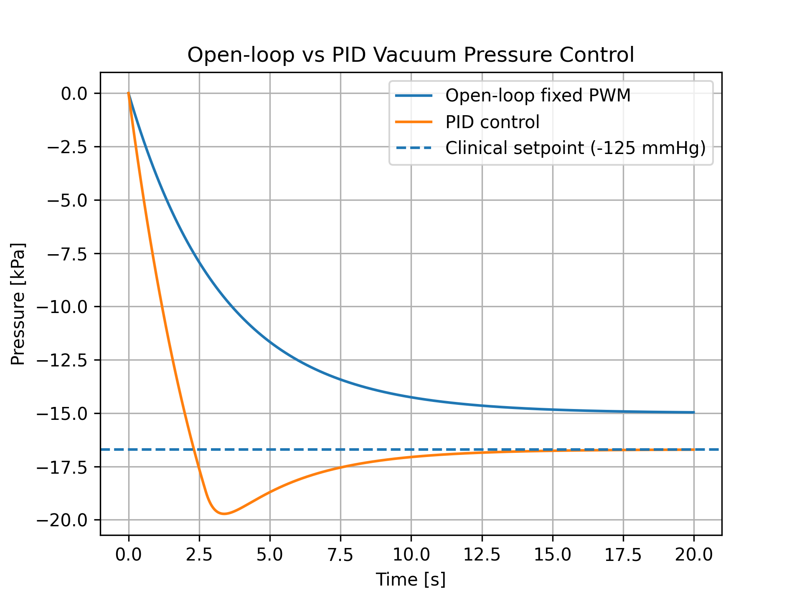
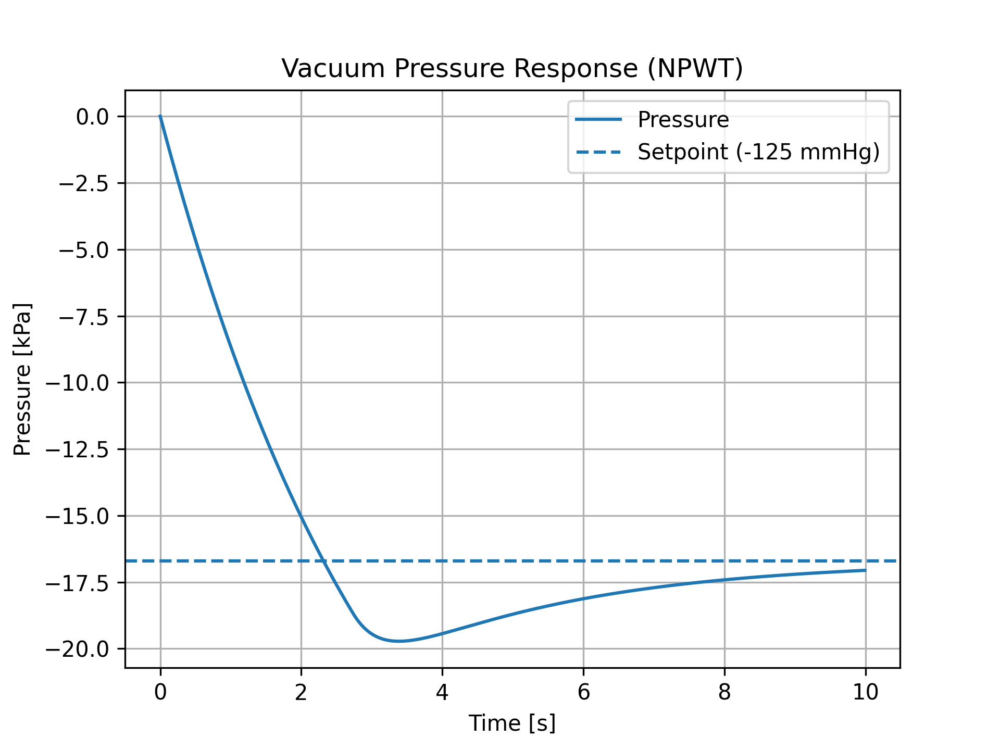
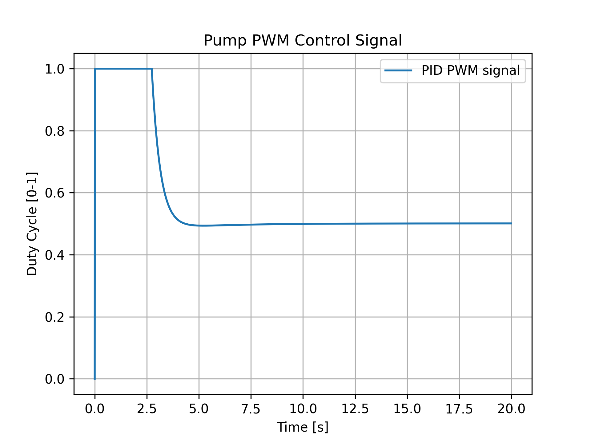
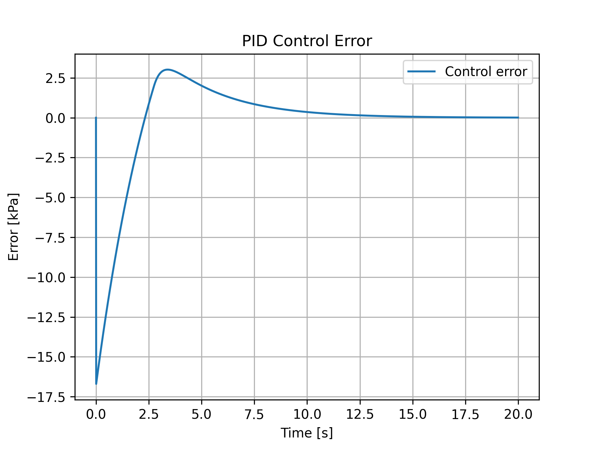

# Control Systems Lab

## Biomedical Vacuum Pressure Control using PID

This project demonstrates the modeling and control of a vacuum pressure system using a PID controller, inspired by biomedical applications such as Negative Pressure Wound Therapy (NPWT).

---

## Problem

Vacuum systems without control cannot guarantee stable pressure due to:

- Leakage
- System disturbances
- Nonlinear behavior of the pump

This leads to unsafe or inefficient operation in real-world applications.

---

## Solution

A closed-loop PID controller is implemented to regulate pressure dynamically.

The system model:

dP/dt = -a·u - b·P

Where:
- P = pressure
- u = PWM control signal
- a = pump gain
- b = leakage coefficient

---

## Clinical Setpoint

- **-125 mmHg ≈ -16.7 kPa**

This value is commonly used in biomedical vacuum therapy.

---

## Results

### Open-loop vs PID

### Pressure response

### Control signal

### Error

---

## Key Insight

- Open-loop control fails to reach and maintain the desired pressure
- PID control dynamically corrects the system
- The system stabilizes around the clinical setpoint

---

## Technologies

- Python
- NumPy
- Matplotlib
- Control Systems (PID)

---

## Project Structure
